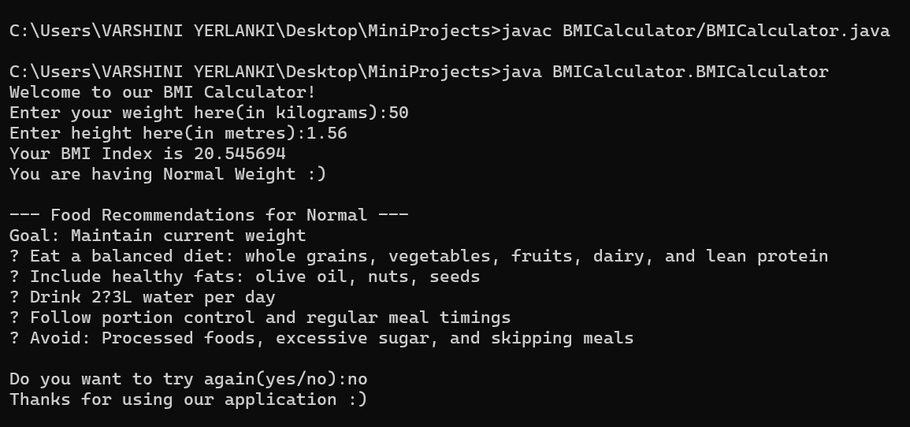

# ⚖️ BMI Calculator

A simple command-line **BMI (Body Mass Index) Calculator** written in Java. This application not only computes your BMI based on height and weight but also offers personalized food suggestions based on your BMI category.

---

## 🚀 Features

- Takes **weight (kg)** and **height (m)** as input
- Calculates **BMI index**
- Classifies user as:
  - Underweight
  - Normal
  - Overweight
  - Obese
- Provides **food recommendations** based on BMI category
- Validates inputs and handles incorrect entries gracefully
- Offers a user-friendly loop to repeat calculations

---

## 💡 BMI Categories

| Category      | BMI Range         |
|---------------|-------------------|
| Underweight   | Less than 18.5    |
| Normal        | 18.5 – 24.9       |
| Overweight    | 25.0 – 29.9       |
| Obese         | 30.0 and above    |

---

## 🥗 Food Recommendations

Based on the BMI category, the app provides dietary suggestions like:

- High-calorie healthy foods for underweight
- Balanced diets for normal BMI
- Low-fat, high-fiber meals for overweight
- Calorie-restricted diets for obesity

---

## 🧠 Concepts Used

- Input validation with conditionals
- BMI calculation: `BMI = weight / (height × height)`
- Switch-case for food suggestions
- Looping with user-controlled repetition
- Exception handling for input mismatch
- Basic animation using `Thread.sleep()`

---

## 📦 Folder Structure

BMICalculator/
│
├── BMICalculator.java # Source code
├── BMICalculator.class # Compiled bytecode
└── README.md # Documentation (this file)

