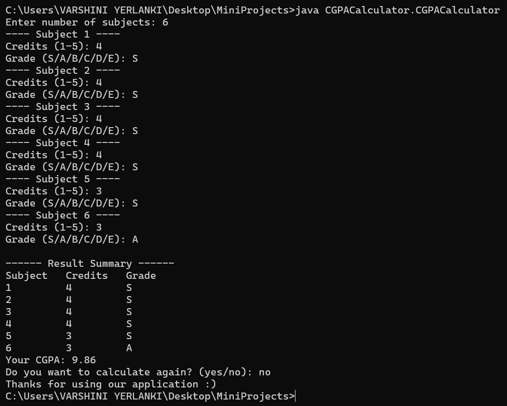

# 🎓 CGPA Calculator

A simple **Java-based CGPA Calculator** console application that allows users to calculate their Cumulative Grade Point Average (CGPA) based on input subjects, credits, and grades.

---

## 🚀 Features

- Accepts user input for any number of subjects.
- Validates credit values and grades.
- Calculates CGPA based on standard grade-to-point conversion.
- Provides a formatted result summary.
- Allows repeated use in a single run.
- Friendly exit message with typing animation.

---

## 🧠 Grade to Point Mapping

| Grade | Grade Point |
|-------|--------------|
| S     | 10           |
| A     | 9            |
| B     | 8            |
| C     | 7            |
| D     | 6            |
| E     | 5            |

---

## 📦 File Structure

CGPACalculator/
│
├── CGPACalculator.java # Source code
├── CGPACalculator.class # Compiled bytecode
└── README.md # Project description (this file)

