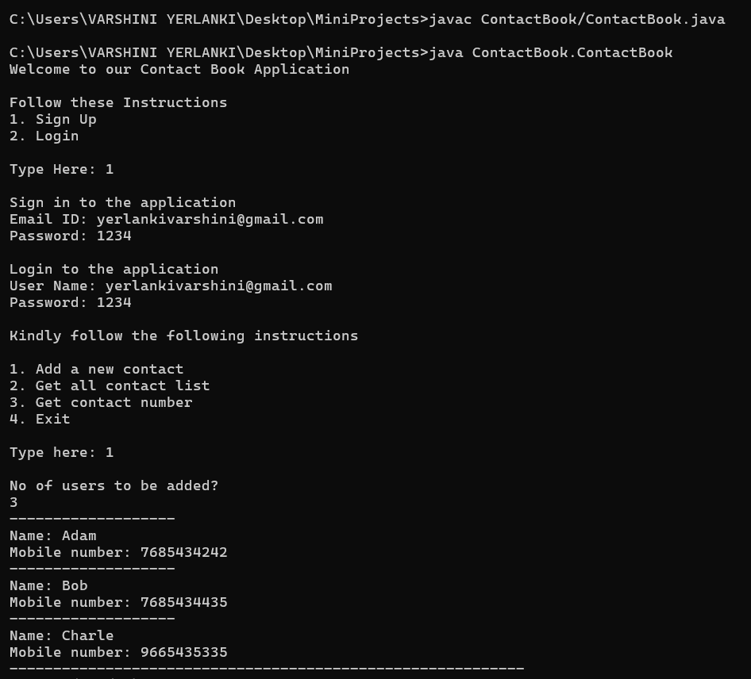
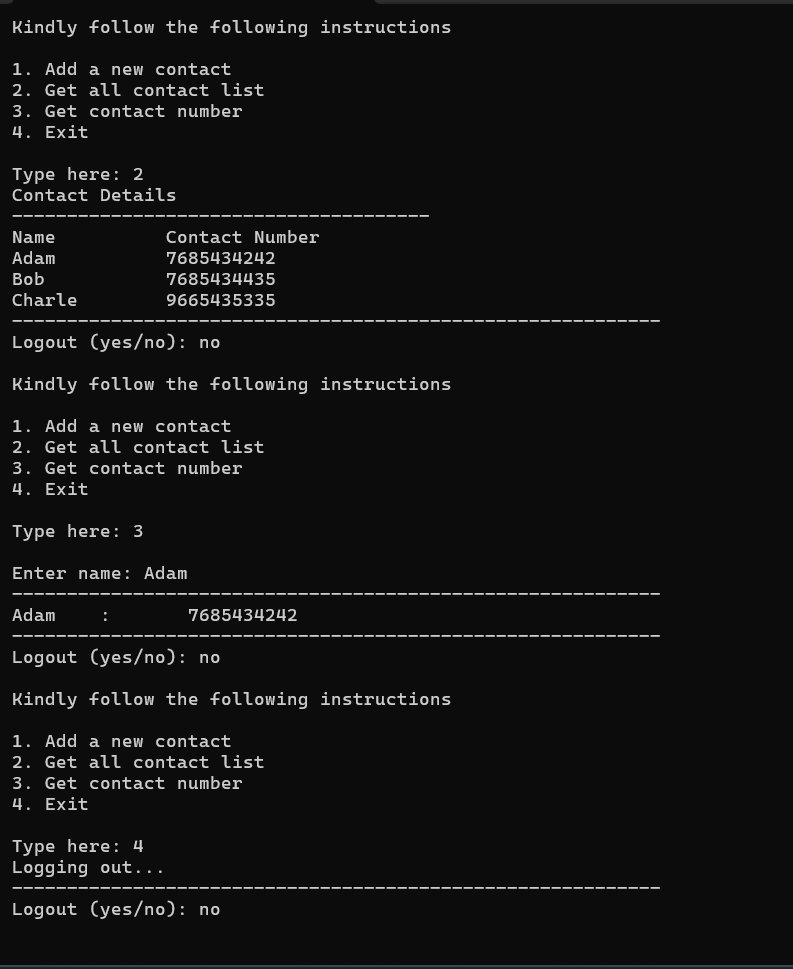

# 📒 ContactBook - Java Mini Project

A simple console-based Contact Book application built using **Java**, featuring user sign-up/login and contact management functionalities.

---

## 🚀 Features

- 🔐 User Registration (Sign Up)
- 🔑 User Authentication (Login)
- 📇 Add New Contacts
- 📋 View All Contacts
- 🔍 Search Contact by Name
- 🔁 Multiple User Support
- 👋 Graceful Logout and Exit

---

## 🧠 Concepts & Technologies

- Core Java
- Object-Oriented Programming (OOP)
- Java Collections (`HashSet`, `HashMap`)
- Input Handling with `Scanner`
- Exception Handling
- Simple Console UI with `Thread.sleep()` effects

---

## 📁 Project Structure

ContactBook/
├── ContactBook.java # Main Java file
├── README.md # Project description


---

## ⚙️ How to Run

### 1️⃣ Prerequisites
- Java installed (JDK 8 or above)
- Any text editor or IDE (like VS Code, IntelliJ, or Eclipse)

### 2️⃣ Steps to Run

```bash
# Compile the code
javac ContactBook.java

# Run the application
java ContactBook

### 🖼️ Screenshots


