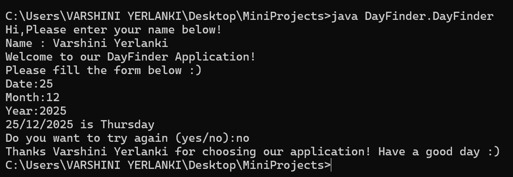

# 📅 Day Finder

A simple command-line **Day Finder** application written in Core Java. This tool takes a valid date (dd/mm/yyyy) as input and returns the day of the week it falls on.

---

## 🚀 Features

- Accepts valid dates as input
- Handles leap years and invalid date formats
- Calculates the correct day using Zeller's Congruence logic (modular arithmetic)
- Friendly user prompts and validations
- Repeats the process until the user chooses to exit

---

## 💡 How It Works

1. The user enters their name.
2. The program asks for a date: day, month, and year.
3. It validates the input (e.g., leap year check, date range).
4. Calculates the day of the week using pre-defined codes and century logic.
5. Displays the result.
6. Repeats as long as the user wants.

---

## 🛠️ Concepts Used

- Modular arithmetic
- Leap year checks
- Switch-case logic
- Date validation rules
- Looping and exception handling
- ASCII animation via `Thread.sleep()`

---

## 📦 Files

DayFinder/
├── DayFinder.java // Main source file
└── README.md // Project documentation (this file)

