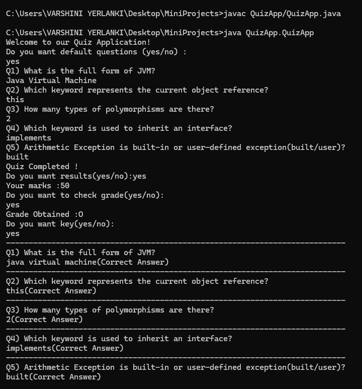

# 🧠 Quiz Application

This is a **command-line based Quiz App** developed using Core Java. It allows users to take a quiz with either default or custom questions, evaluates their answers, provides scores, assigns grades, and optionally displays the correct answers at the end.

---

## 🚀 Features

- 🏁 Option to start with **default questions** or **custom input**
- 📝 Validates answers **case-insensitively**
- ✅ Displays **score and grade**
- 📚 Optionally displays correct answers and feedback
- ⏱️ Simple animation at launch using `Thread.sleep`

---

## 🧪 How It Works

1. The user chooses to take a quiz with **default** or **custom questions**.
2. The user answers each question one by one.
3. At the end, the app:
   - Calculates the **score** (each correct answer gives 10 marks)
   - Shows the **grade** based on score percentage
   - Optionally shows the **correct answers and comparison** with user answers

---

## 🎓 Grading Criteria

| Percentage     | Grade |
|----------------|-------|
| 91% and above  | O     |
| 81% – 90%      | A     |
| 66% – 80%      | B     |
| 50% – 65%      | C     |
| Below 50%      | D     |

---

## 🧠 Default Questions

If the user opts for default questions, these will be asked:

1. What is the full form of JVM?  
2. Which keyword represents the current object reference?  
3. How many types of polymorphisms are there?  
4. Which keyword is used to inherit an interface?  
5. Arithmetic Exception is built-in or user-defined exception (built/user)?

---

## 🛠️ Technologies Used

- Java Core (`Scanner`, arrays, loops, conditionals)
- Console-based input/output
- Custom logic for score and grading
- `Thread.sleep()` for animated welcome text

---

## 📂 Project Structure

QuizApp/
├── QuizApp.java # Main Java source file
└── README.md # Project documentation (this file)

## 🖼️ Screenshot

